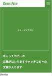

# MDN Exercise 01


株式会社Grass FieldのWebサイトをFigmaデザインから模写したプロジェクトです。


## プロジェクト概要

このプロジェクトは、Figmaで作成されたデザインをHTML/CSS/JavaScriptで実装した模写練習用のWebサイトです。レスポンシブデザインに対応し、モバイルファーストのアプローチで実装されています。

## 使用技術

- HTML5
- CSS3（CSS変数、Flexbox、Grid等）
- JavaScript（Vanilla JS）
- Google Fonts（Noto Sans JP、Oswald）

## プロジェクト構造

```
mdn-ex-01/
├── index.html          # メインのHTMLファイル
├── css/
│   ├── common.css      # 共通スタイル（リセット、変数、共通コンポーネント）
│   └── top.css         # トップページ専用スタイル
├── js/
│   └── common.js       # 共通JavaScript（ハンバーガーメニュー等）
├── img/                # 画像ファイル
└── README.md
```

## 主な機能

- レスポンシブデザイン対応
- ハンバーガーメニュー（モバイル表示時）
- メインビジュアル
- サービス一覧セクション
- 商品ピックアップセクション

## 使い方

1. プロジェクトをクローンまたはダウンロード
2. `index.html`をブラウザで開く

## デザインファイル

元のFigmaデザインは以下のリンクから確認できます：

[Figmaデザインファイル](https://www.figma.com/design/1UBLjyot6ziDxBBG6hvp8P/EXERCISE01?node-id=0-1&p=f&t=Lz3RfC5DiF4rOeNF-0)

## ブラウザ対応

- Chrome（最新版）
- Firefox（最新版）
- Safari（最新版）
- Edge（最新版）

## ライセンス

このプロジェクトは練習用のため、商用利用は想定していません。